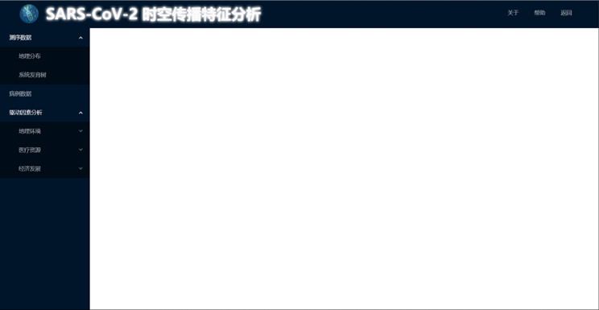
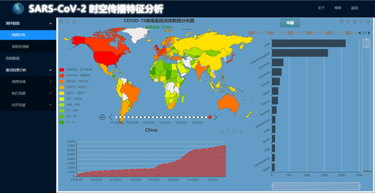
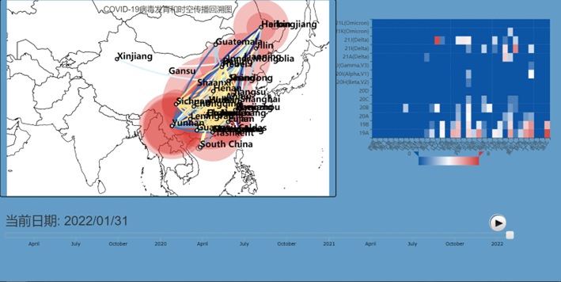
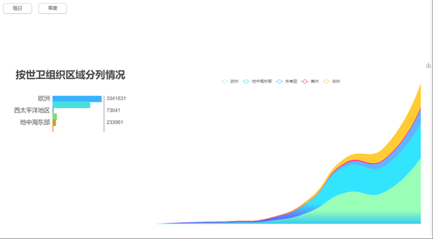
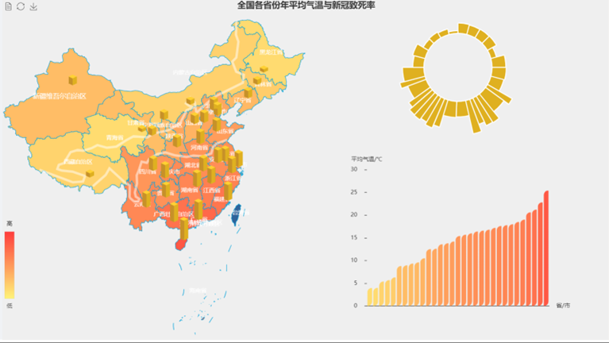
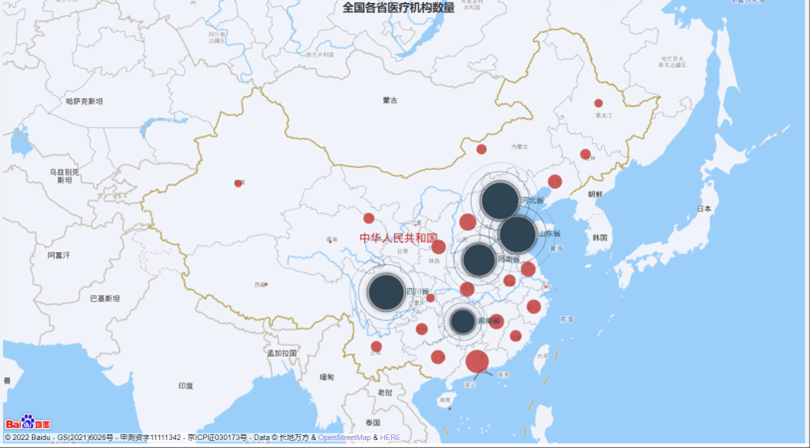
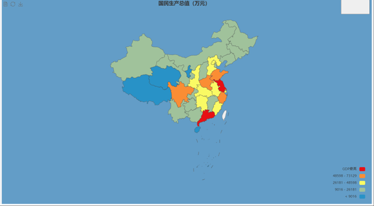
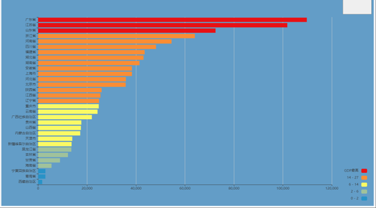

## Background

A web-mapping system visualized global gene sequencing data in scales of different regions, dates and driving-factors and displayed some data analysis results such as gene trees on it.

My job is to design web-pages showing how the driving factor, like precipitation and temperature, influencing the transmission of COVID-19 in electronic maps and display confirmed cases aping WHO(World Health Organization) COVID-19 DASHBOARD using Typescript, ECHARTS, NPM and third-party map API.

## demo
 **UI** 

 **geography distribution** 

 **virus development** 

 **confirmed case data** 

 **geography environment** 

 **medical resource** 

 **economy** 

